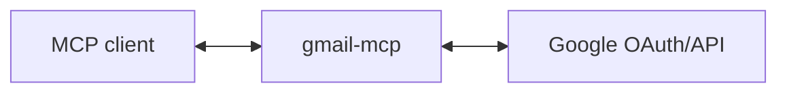

# gmail-mcp

MCP server for Gmail - read, send, archive, and manage emails.

## Setup

### 1. Create Google OAuth credentials

1. Go to [Google Cloud Console](https://console.cloud.google.com/)
2. Create a new project (or use existing)
3. Enable the Gmail API
4. Go to **APIs & Services** → **OAuth consent screen**, set up consent screen
5. Go to **APIs & Services** → **Credentials** → **Create Credentials** → **OAuth client ID**
6. Choose **Web application**
7. Add `http://localhost:3000/callback` to **Authorized redirect URIs**
8. Note your Client ID and Client Secret

### 2. Run the server

```bash
GOOGLE_CLIENT_ID='your-client-id' \
GOOGLE_CLIENT_SECRET='your-client-secret' \
MCP_TRANSPORT=http \
npm start
```

The server runs on `http://localhost:3000` by default. Change with `PORT=3001`.

### 3. Add to your MCP client

```bash
claude mcp add --transport http gmail-mcp http://localhost:3000/mcp
```

## Architecture

This server acts as an **OAuth proxy** to Google:



1. Server advertises itself as an OAuth authorization server via `/.well-known/oauth-authorization-server`
2. `/register` returns the Google OAuth client credentials
3. `/authorize` redirects to Google, encoding the client's callback URL in state
4. `/callback` receives the code from Google and forwards to the client's callback
5. `/token` proxies token requests to Google, injecting client credentials
6. `/mcp` handles MCP requests, using the bearer token to call Gmail API

The server holds no tokens or state - it just proxies OAuth to Google.

## Tools

| Tool | Description |
|------|-------------|
| `gmail_get_profile` | Get user's email address and profile info |
| **Messages** | |
| `gmail_messages_list` | Search/list messages (consider `gmail_threads_list` instead) |
| `gmail_message_get` | Get a single message |
| `gmail_message_send` | Send an email |
| `gmail_message_modify` | Add/remove labels |
| `gmail_message_archive` | Archive (remove from inbox) |
| `gmail_message_trash` | Move to trash |
| `gmail_message_untrash` | Restore from trash |
| `gmail_message_delete` | Permanently delete |
| `gmail_messages_batch_modify` | Bulk label changes |
| `gmail_messages_batch_delete` | Bulk permanent delete |
| **Threads** | |
| `gmail_threads_list` | Search/list threads (recommended) |
| `gmail_thread_get` | Get all messages in a thread (recommended) |
| `gmail_thread_modify` | Add/remove labels |
| `gmail_thread_trash` | Move to trash |
| `gmail_thread_untrash` | Restore from trash |
| `gmail_thread_delete` | Permanently delete |
| **Drafts** | |
| `gmail_drafts_list` | List drafts |
| `gmail_draft_get` | Get a draft |
| `gmail_draft_create` | Create a draft |
| `gmail_draft_update` | Update a draft |
| `gmail_draft_send` | Send a draft |
| `gmail_draft_delete` | Delete a draft |
| **Labels** | |
| `gmail_labels_list` | List all labels |
| `gmail_label_get` | Get a label |
| `gmail_label_create` | Create a label |
| `gmail_label_update` | Update a label |
| `gmail_label_delete` | Delete a label |
| **Attachments** | |
| `gmail_attachment_get` | Download attachment |
| **Filters** | |
| `gmail_filters_list` | List email filters |
| `gmail_filter_get` | Get a filter |
| `gmail_filter_create` | Create a filter |
| `gmail_filter_delete` | Delete a filter |
| **Settings** | |
| `gmail_vacation_get` | Get vacation auto-reply settings |
| `gmail_vacation_set` | Set vacation auto-reply settings |

## Gmail API Scopes

- `gmail.readonly` - Read messages and labels
- `gmail.send` - Send messages
- `gmail.modify` - Modify messages (archive, labels, trash)

## Contributing

Pull requests are welcomed on GitHub! To get started:

1. Install Git and Node.js
2. Clone the repository
3. Install dependencies with `npm install`
4. Run `npm run test` to run tests
5. Build with `npm run build`

## Releases

Versions follow the [semantic versioning spec](https://semver.org/).

To release:

1. Use `npm version <major | minor | patch>` to bump the version
2. Run `git push --follow-tags` to push with tags
3. Wait for GitHub Actions to publish to the NPM registry.
