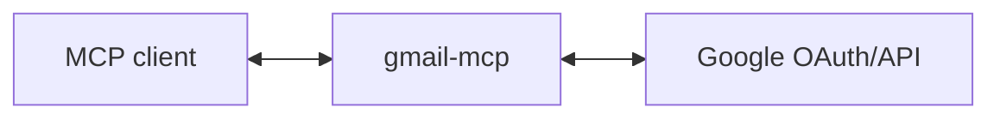

# gmail-mcp

MCP server for Gmail - read, send, archive, and manage emails.

## Setup

### 1. Create Google OAuth credentials

1. Go to [Google Cloud Console](https://console.cloud.google.com/)
2. Create a new project (or use existing)
3. Enable the Gmail API
4. Go to **APIs & Services** → **OAuth consent screen**, set up consent screen
5. Go to **APIs & Services** → **Credentials** → **Create Credentials** → **OAuth client ID**
6. Choose **Web application**
7. Add `http://localhost:3000/callback` to **Authorized redirect URIs**
8. Note your Client ID and Client Secret

### 2. Run the server

```bash
GOOGLE_CLIENT_ID='your-client-id' \
GOOGLE_CLIENT_SECRET='your-client-secret' \
MCP_TRANSPORT=http \
npm start
```

The server runs on `http://localhost:3000` by default. Change with `PORT=3001`.

### 3. Add to your MCP client

```bash
claude mcp add gmail-mcp http://localhost:3000/mcp
```

## Architecture

This server acts as an **OAuth proxy** to Google:



1. Server advertises itself as an OAuth authorization server via `/.well-known/oauth-authorization-server`
2. `/register` returns the Google OAuth client credentials
3. `/authorize` redirects to Google, encoding the client's callback URL in state
4. `/callback` receives the code from Google and forwards to the client's callback
5. `/token` proxies token requests to Google, injecting client credentials
6. `/mcp` handles MCP requests, using the bearer token to call Gmail API

The server holds no tokens or state - it just proxies OAuth to Google.

## Tools

| Tool | Description |
|------|-------------|
| `gmail_messages_list` | Search/list messages in mailbox |
| `gmail_message_get` | Get full message content |
| `gmail_message_send` | Send an email |
| `gmail_message_archive` | Archive a message (remove from inbox) |
| `gmail_message_trash` | Move message to trash |
| `gmail_message_modify` | Add/remove labels |
| `gmail_labels_list` | List all labels |
| `gmail_draft_create` | Create a draft email |
| `gmail_thread_get` | Get full email thread |

## Gmail API Scopes

- `gmail.readonly` - Read messages and labels
- `gmail.send` - Send messages
- `gmail.modify` - Modify messages (archive, labels, trash)

## Development

```bash
npm install
npm run build
npm run lint
npm test
```
